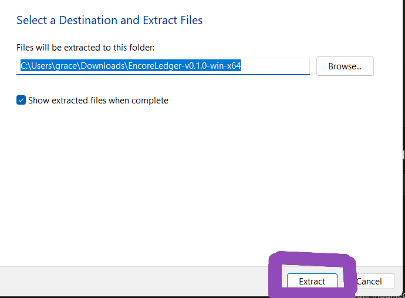

## Table of Contents
- [Overview](#overview)
- [Features](#features)
- [Installation Instructions](#installation-instructions)
- [How to Use](#how-to-use)
- [Troubleshooting](#troubleshooting)
- [FAQ](#faq)
- [License](#license)
- [Contact](#contact)

---

## Overview

Encore Ledger (v1.0.0) is a simple and user-friendly finance management application designed to help you track income and expenses across multiple bank accounts. 

Built as a desktop application, it **requires no cloud connectivity or internet dependency**. With this application, your **financial data stays completely local** and secure on your computer.

## Features
- **Transaction Tracking** – Record income and expense transactions
- **Edit & Manage** – Modify or delete transaction entries as needed
- **Customizable Categories** – Organize transactions with user-defined categories
- **Bulk Import** – Import transactions from CSV files to save time on data entry
- **Multi-Account Management** – Create and manage multiple accounts (checking, savings, etc.) in one place
- **Local Data Storage** – All your financial data is stored locally on your computer for privacy and security

## Installation Instructions

Follow these steps to download and run the project.   
<b>No technical background is required.</b>

### 1. Navigate to the Releases Section 
- Go to the **Releases** section of this GitHub repository.
- Located under the **About** section

<!-- Light mode image -->

<!-- Dark mode image -->

### 2. Download the Latest Release
- Find the newest version at the top.
- Download the file named like:  
  `EncoreLedger-vX.X.X.zip`

<!-- Light mode image -->

<!-- Dark mode image -->

### 3. Extract the ZIP File
- Locate the downloaded `.zip` file on your computer (usually in the **Downloads** folder).
- Right-click the file and select **Extract All…**
- Choose a folder where you want the project to be stored.
- Click **Extract**.

  

  

### 4. Open the Project Folder
- After extraction, open the new folder that appears.
- You should see files such as:  
  - `EncoreLedger.exe` (or your main application file)  
  - Additional folders or resources included with the release

### 5. Run the Program
- Double-click the main application file to start the program.
- If Windows shows a security prompt, select **More Info** and then **Run Anyway**.

### 6. Installation Complete
- The program should now open and run normally.
- If you experience issues, refer to the [Troubleshooting](#troubleshooting) section below.

  

## How to Use

After [running the program](#5-run-the-program), you will be greeted with the following introductory screen:

Following are some additional in-depth tutorials on how to utilize all the features of Encore Ledger to their fullest potential. Click **Create Your First Account** on the Welcome screen to get started!

### 1. Create Account

  
Show steps

   

  - Enter an account name
  - Choose an account type
  - Click **+ Add**

  

### 2. Adding Transactions

  
Show steps

   

  - Click **Transactions** in the navigation bar at the top. This will redirect you to the Transaction Dashboard:

  

   

  - From here, click **+ Add New**

  

  - Enter *at least* a Date of Transaction, Amount, and Account to create your first Transaction.
  - Click **+ Add* to add your first Transaction and be redirected back to the Transaction Dashboard!

### 3. Editing Transactions

  
Show steps

   

  - Select any Transaction from the Transaction Dashboard by checking the checkbox in the leftmost table cell.
  - Click **Edit** after selecting a Transaction to Edit a Transaction.
  
  

   

  - Please note that ID, Date Created, Date Edited, Import Type, and Bulk Import fields are *read-only* and cannot be edited.

### 4. Bulk Import Transactions

  
Show steps

   
  
  - Click **Transactions** in the navigation bar at the top. This will redirect you to the Transaction Dashboard:

  

   

  - From here, click **+ Add New** and scroll to the bottom
  - Select the Account you are importing from
  - Select the file containing your bank transactions to attach
    - Look up "How to download a CSV file from (bank name) in order to access instructions on how to get said file from your bank.

  

  - Any pending transactions in your specific CSV file? Import them now with today's date or ignore them and import them later when the transaction goes through.
  - Direct the web app on how to parse your specific bank's CSV file -- which column displays the Date? Which displays the amount? Does your bank include withdrawals and deposits in the same column ("Amount") or do you need to call on column "Debit" and another "Credit"?
  - Save this mapping structure so you only have to do it once! Give it a name and click "Save Mapping" down below to keep it.
  - Click **Confirm Import**, which redirects you back to the Transaction Dashboard

   

  

   

  - Message displays at the top of the screen, declaring number of Transaction successfully imported, ignored (in the case of pending transactions), or failed.
  
  

### 5. Add Categories

  
Show steps

   

  - Enter a category name
  - Give the category a more in-depth description (optional)
  - Click **+ Add**
  
  

### 6. Bulk Edit Transactions

  
Show steps

   

  - Select Transactions you want to edit the same way
  
  

  - Make your edits
  - Click **Save**
  
  

  - Update your Transactions

  

## Troubleshooting
<!-- TO DO -->

## FAQ

### **Does Encore Ledger require internet?**
No — it is fully offline. All data stays on your device.

### **Where is my data stored?**
In a local SQLite database file inside the application folder.

### **Can I back up my data?**
Yes — copy the `.db` file to any backup location.

### **Can I move Encore Ledger to another computer?**
Yes — copy the entire extracted folder (including the `.db` file).

### **Can I import transactions from my bank?**
Yes — as long as your bank provides a CSV export.

#### **Does the app auto-save?**
No, not as of v.2.0.0

#### **Can I customize categories?**
Yes — categories can be added, renamed, or removed.

#### **Is my data encrypted?**
Data is local but not encrypted by default.

#### **Will there be future updates?**
Future updates will be posted in the **Releases** section.

## License
<!-- TO DO -->

## Contact
<!-- TO DO -->
